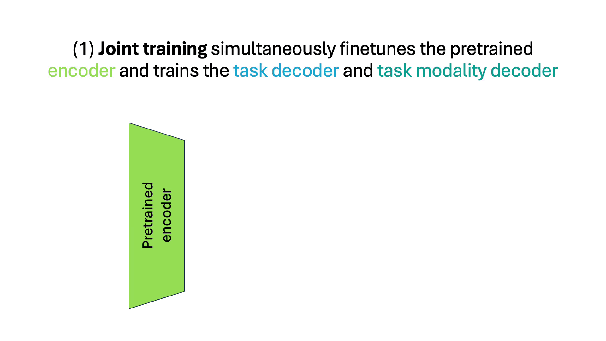
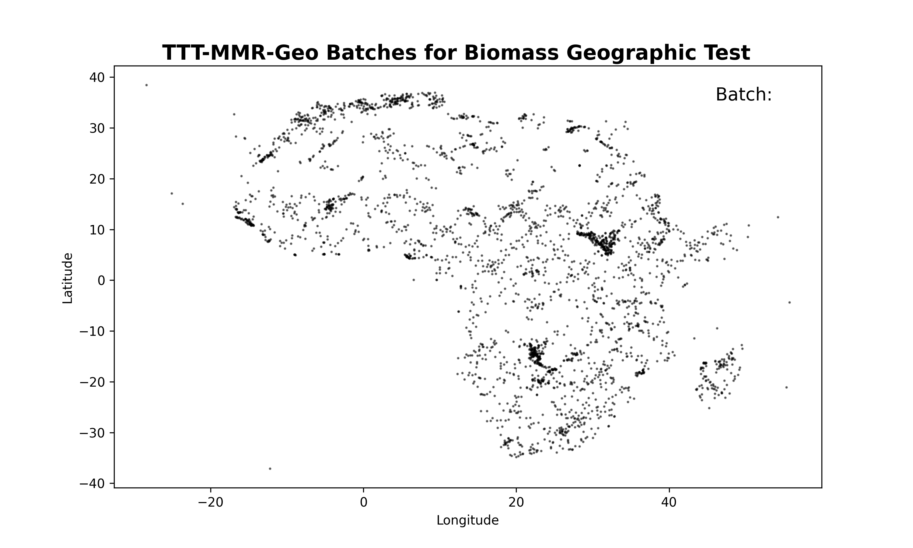

<h1 align="center">MMEarth-Bench</h1>

<p align="center">
  
  &nbsp;&nbsp;
  Lucia Gordon, Serge Belongie, Christian Igel, Nico Lang
  &nbsp;&nbsp;
  
</p>

<p align="center">
  <a href="https://lgordon99.github.io/mmearth-bench/">Project page 🌐</a> | <a href="https://lgordon99.github.io/mmearth-bench-app/">MMEarth-Bench Explorer 🗺️</a>
</p>

<p align="center">
	
</p>

## MMEarth-Bench downstream tasks

| Task | # Tiles | Unit | Scale | Type | License |
|---|---:|---|:---:|:---:|---|
| Biomass | 18,393 | Mg/ha | Pixel-level | Regression | [CC BY](https://creativecommons.org/licenses/by/4.0/) |
| Soil Nitrogen | 5,643 | g/kg | Tile-level | Regression | [CC BY-NC](https://creativecommons.org/licenses/by-nc/4.0/) |
| Soil Organic Carbon | 7,982 | g/kg | Tile-level | Regression | [CC BY-NC](https://creativecommons.org/licenses/by-nc/4.0/) |
| Soil pH | 8,508 | Unitless | Tile-level | Regression | [CC BY-NC](https://creativecommons.org/licenses/by-nc/4.0/) |
| Species | 36,410 | Presence/absence | Tile-level | Multi-label classification | [Terms of Use](https://www.iucnredlist.org/terms/terms-of-use) |

## MMEarth-Bench task modalities

| Modality | Bands | Scale | Type |
|---|---|:---:|:---:|
| Sentinel-2 | B1, B2, B3, B4, B5, B6, B7, B8, B8A, B9, B11, B12 | Pixel-level | Continuous |
| Sentinel-1 | Ascending VV, VH, HH, HV;<br>Descending VV, VH, HH, HV | Pixel-level | Continuous |
| ASTER GDEM | Elevation, slope | Pixel-level | Continuous |
| ETH Global Canopy Height | Height, uncertainty | Pixel-level | Continuous |
| Dynamic World | Landcover | Pixel-level | Categorical |
| ESA WorldCover | Landcover | Pixel-level | Categorical |
| Precipitation | Previous month, month, year | Tile-level | Continuous |
| Temperature | Previous month max, mean, min;<br>month max, mean, min;<br>year max, mean, min | Tile-level | Continuous |
| Geolocation | Longitude, latitude | Tile-level | Continuous |
| Sentinel-2 date | Date | Tile-level | Continuous |
| Biome | Biome number | Tile-level | Categorical |
| Ecoregion | Ecoregion number | Tile-level | Categorical |

## Benchmarking results on MMEarth-Bench
Models are ranked by their performance on each task after finetuning on 100% of the training data.

<table>
  <thead>
    <tr>
      <th align="center"><b>Split</b></th>
      <th align="center"><b>Rank</b></th>
      <th align="center"><b>All tasks</b></th>
      <th align="center"><b>Biomass</b></th>
      <th align="center"><b>Soil N</b></th>
      <th align="center"><b>Soil OC</b></th>
      <th align="center"><b>Soil pH</b></th>
      <th align="center"><b>Species</b></th>
    </tr>
  </thead>
  <tbody>
    <tr style="font-weight: bold;">
      <td align="center" rowspan="8"><b>Random</b></td>
      <td align="center">1</td>
      <td align="center"><span style="color: Teal;">Copernicus-FM</span></td>
      <td align="center"><span style="color: red;">MPMAE</span></td>
      <td align="center"><span style="color: Brown;">TerraMind</span></td>
      <td align="center"><span style="color: Teal;">Copernicus-FM</span></td>
      <td align="center"><span style="color: Brown;">TerraMind</span></td>
      <td align="center"><span style="color: Teal;">Copernicus-FM</span></td>
    </tr>
    <tr>
      <td align="center">2</td>
      <td align="center"><span style="color: Brown;">TerraMind</span></td>
      <td align="center"><span style="color: Teal;">Copernicus-FM</span></td>
      <td align="center"><span style="color: Teal;">Copernicus-FM</span></td>
      <td align="center"><span style="color: Magenta;">MPMAE</span></td>
      <td align="center"><span style="color: Teal;">Copernicus-FM</span></td>
      <td align="center"><span style="color: Brown;">TerraMind</span></td>
    </tr>
    <tr>
      <td align="center">3</td>
      <td align="center"><span style="color: Magenta;">MPMAE</span></td>
      <td align="center"><span style="color: Brown;">TerraMind</span></td>
      <td align="center"><span style="color: Magenta;">MPMAE</span></td>
      <td align="center"><span style="color: Brown;">TerraMind</span></td>
      <td align="center"><span style="color: Magenta;">MPMAE</span></td>
      <td align="center"><span style="color: Magenta;">MPMAE</span></td>
    </tr>
    <tr>
      <td align="center">4</td>
      <td align="center"><span style="color: Purple;">SatlasNet</span></td>
      <td align="center"><span style="color: Red;">DINOv3 Sat</span></td>
      <td align="center"><span style="color: Red;">DINOv3 Sat</span></td>
      <td align="center"><span style="color: Purple;">SatlasNet</span></td>
      <td align="center"><span style="color: ForestGreen;">DINOv3 Web</span></td>
      <td align="center"><span style="color: Purple;">SatlasNet</span></td>
    </tr>
    <tr>
      <td align="center">5</td>
      <td align="center"><span style="color: Red;">DINOv3 Sat</span></td>
      <td align="center"><span style="color: Purple;">SatlasNet</span></td>
      <td align="center"><span style="color: ForestGreen;">DINOv3 Web</span></td>
      <td align="center"><span style="color: RoyalBlue;">ConvNeXtV2A</span></td>
      <td align="center"><span style="color: Red;">DINOv3 Sat</span></td>
      <td align="center"><span style="color: Red;">DINOv3 Sat</span></td>
    </tr>
    <tr>
      <td align="center">6</td>
      <td align="center"><span style="color: ForestGreen;">DINOv3 Web</span></td>
      <td align="center"><span style="color: ForestGreen;">DINOv3 Web</span></td>
      <td align="center"><span style="color: Purple;">SatlasNet</span></td>
      <td align="center"><span style="color: ForestGreen;">DINOv3 Web</span></td>
      <td align="center"><span style="color: Purple;">SatlasNet</span></td>
      <td align="center"><span style="color: ForestGreen;">DINOv3 Web</span></td>
    </tr>
    <tr>
      <td align="center">7</td>
      <td align="center"><span style="color: RoyalBlue;">ConvNeXtV2A</span></td>
      <td align="center"><span style="color: Orange;">Scale-MAE</span></td>
      <td align="center"><span style="color: RoyalBlue;">ConvNeXtV2A</span></td>
      <td align="center"><span style="color: Orange;">Scale-MAE</span></td>
      <td align="center"><span style="color: Orange;">Scale-MAE</span></td>
      <td align="center"><span style="color: Orange;">Scale-MAE</span></td>
    </tr>
    <tr>
      <td align="center">8</td>
      <td align="center"><span style="color: Orange;">Scale-MAE</span></td>
      <td align="center"><span style="color: RoyalBlue;">ConvNeXtV2A</span></td>
      <td align="center"><span style="color: Orange;">Scale-MAE</span></td>
      <td align="center"><span style="color: Red;">DINOv3 Sat</span></td>
      <td align="center"><span style="color: RoyalBlue;">ConvNeXtV2A</span></td>
      <td align="center"><span style="color: RoyalBlue;">ConvNeXtV2A</span></td>
    </tr>
    <tr style="font-weight: bold;">
      <td align="center" rowspan="8"><b>Geographic</b></td>
      <td align="center">1</td>
      <td align="center"><span style="color: Teal;">Copernicus-FM</span></td>
      <td align="center"><span style="color: Magenta;">MPMAE</span></td>
      <td align="center"><span style="color: Red;">DINOv3 Sat</span></td>
      <td align="center"><span style="color: Teal;">Copernicus-FM</span></td>
      <td align="center"><span style="color: Brown;">TerraMind</span></td>
      <td align="center"><span style="color: Teal;">Copernicus-FM</span></td>
    </tr>
    <tr>
      <td align="center">2</td>
      <td align="center"><span style="color: Magenta;">MPMAE</span></td>
      <td align="center"><span style="color: Brown;">TerraMind</span></td>
      <td align="center"><span style="color: Teal;">Copernicus-FM</span></td>
      <td align="center"><span style="color: Magenta;">MPMAE</span></td>
      <td align="center"><span style="color: Purple;">SatlasNet</span></td>
      <td align="center"><span style="color: Brown;">TerraMind</span></td>
    </tr>
    <tr>
      <td align="center">3</td>
      <td align="center"><span style="color: Brown;">TerraMind</span></td>
      <td align="center"><span style="color: Teal;">Copernicus-FM</span></td>
      <td align="center"><span style="color: Magenta;">MPMAE</span></td>
      <td align="center"><span style="color: Purple;">SatlasNet</span></td>
      <td align="center"><span style="color: Magenta;">MPMAE</span></td>
      <td align="center"><span style="color: Magenta;">MPMAE</span></td>
    </tr>
    <tr>
      <td align="center">4</td>
      <td align="center"><span style="color: Purple;">SatlasNet</span></td>
      <td align="center"><span style="color: Red;">DINOv3 Sat</span></td>
      <td align="center"><span style="color: Brown;">TerraMind</span></td>
      <td align="center"><span style="color: Brown;">TerraMind</span></td>
      <td align="center"><span style="color: ForestGreen;">DINOv3 Web</span></td>
      <td align="center"><span style="color: Red;">DINOv3 Sat</span></td>
    </tr>
    <tr>
      <td align="center">5</td>
      <td align="center"><span style="color: Red;">DINOv3 Sat</span></td>
      <td align="center"><span style="color: Purple;">SatlasNet</span></td>
      <td align="center"><span style="color: ForestGreen;">DINOv3 Web</span></td>
      <td align="center"><span style="color: RoyalBlue;">ConvNeXtV2A</span></td>
      <td align="center"><span style="color: Red;">DINOv3 Sat</span></td>
      <td align="center"><span style="color: ForestGreen;">DINOv3 Web</span></td>
    </tr>
    <tr>
      <td align="center">6</td>
      <td align="center"><span style="color: ForestGreen;">DINOv3 Web</span></td>
      <td align="center"><span style="color: ForestGreen;">DINOv3 Web</span></td>
      <td align="center"><span style="color: RoyalBlue;">ConvNeXtV2A</span></td>
      <td align="center"><span style="color: ForestGreen;">DINOv3 Web</span></td>
      <td align="center"><span style="color: Teal;">Copernicus-FM</span></td>
      <td align="center"><span style="color: Purple;">SatlasNet</span></td>
    </tr>
    <tr>
      <td align="center">7</td>
      <td align="center"><span style="color: RoyalBlue;">ConvNeXtV2A</span></td>
      <td align="center"><span style="color: RoyalBlue;">ConvNeXtV2A</span></td>
      <td align="center"><span style="color: Purple;">SatlasNet</span></td>
      <td align="center"><span style="color: Orange;">Scale-MAE</span></td>
      <td align="center"><span style="color: RoyalBlue;">ConvNeXtV2A</span></td>
      <td align="center"><span style="color: Orange;">Scale-MAE</span></td>
    </tr>
    <tr>
      <td align="center">8</td>
      <td align="center"><span style="color: Orange;">Scale-MAE</span></td>
      <td align="center"><span style="color: Orange;">Scale-MAE</span></td>
      <td align="center"><span style="color: Orange;">Scale-MAE</span></td>
      <td align="center"><span style="color: Red;">DINOv3 Sat</span></td>
      <td align="center"><span style="color: Orange;">Scale-MAE</span></td>
      <td align="center"><span style="color: RoyalBlue;">ConvNeXtV2A</span></td>
    </tr>
  </tbody>

</table>


## Test-Time Training with Multimodal Reconstruction (TTT-MMR)
We propose test-time training with multimodal reconstruction (TTT-MMR) to improve model performance at test-time using task modalities as reconstruction tasks.
<p align="center">
  
</p>
Our TTT-MMR-Geo method batches the test tiles based on geographic proximity using recursive spatial partitioning.
<p align="center">
  
</p>

## Downloading the MMEarth-Bench data

To download the MMEarth-Bench data, run
```
mkdir -p mmearth-bench-data/{biomass,soil_nitrogen,soil_organic_carbon,soil_pH,species} && for task in biomass soil_nitrogen soil_organic_carbon soil_pH species; do wget -c -P "mmearth-bench-data/$task" "https://sid.erda.dk/share_redirect/cbMhbwV1yP/mmearth-bench-data/$task/$task.h5" "https://sid.erda.dk/share_redirect/cbMhbwV1yP/mmearth-bench-data/$task/${task}_split_data.json"; done && wget -c -P mmearth-bench-data/species "https://sid.erda.dk/share_redirect/cbMhbwV1yP/mmearth-bench-data/species/species_labels.json" && wget -c -P mmearth-bench-data "https://sid.erda.dk/share_redirect/cbMhbwV1yP/mmearth-bench-data/no_data_values.json"
```

This will create the following folder structure, occupying 59 GB.
<pre>
mmearth-bench-data/
├── biomass/
│   ├── biomass_split_data.json
│   └── biomass.h5
├── soil_nitrogen/
│   ├── soil_nitrogen_split_data.json
│   └── soil_nitrogen.h5
├── soil_organic_carbon/
│   ├── soil_organic_carbon_split_data.json
│   └── soil_organic_carbon.h5
├── soil_pH/
│   ├── soil_pH_split_data.json
│   └── soil_pH.h5
├── species/
│   ├── species_labels.json
│   ├── species_split_data.json
│   └── species.h5
└── no_data_values.json
</pre>

## Config file
If you will be running our code files, create a file called `config-user.yml` in the code directory with the following contents.
```
data_dir_path: 'DATA_DIR_PATH'
env_path: 'ENV_PATH'
email: 'EMAIL'
partitions: 'PARTITION_1,PARTITION_2'

# The below are only needed for training and evaluating models
gpu_partitions: 'GPU_PARTITION_1,GPU_PARTITION_2'
entity: 'WANDB_ENTITY'
project: 'WANDB_PROJECT_NAME'
```

<details>
<summary><h2 style="display: inline;">Reading the MMEarth-Bench data</h2></summary>
Both modalities and task names can be provided as keys to the H5 files. For any valid `KEY`, the following code extracts the relevant data from the H5 file at `PATH_TO_H5`.

```python
import h5py
import json

with h5py.File(PATH_TO_H5, 'r') as h5_file:
  if KEY in ['sentinel2_date', 'crs', 'sentinel2_system_index']:
    key_data = h5_file[KEY].asstr()[...]
  elif KEY in ['missing_modalities', 'species']:
    key_data = [json.loads(lst) for lst in h5_file[KEY].asstr()[...]]
  elif KEY in ['Sentinel2', 'Sentinel1', 'ASTER_GDEM', 'ETH_GCH', 'DynamicWorld', 'ESA_WorldCover', 'precipitation', 'temperature',    'geolocation_encoding', 'month_encoding', 'biome', 'ecoregion', 'biomass', 'soil_nitrogen', 'soil_organic_carbon', 'soil_pH', 'MSK_CLDPRB', 'S2CLOUDLESS', 'SCL', 'geolocation', 'MSK_CLDPRB_CLOUDY_PIXEL_FRACTION', 'S2CLOUDLESS_CLOUDY_PIXEL_FRACTION', 'SCL_NO_DATA_PIXEL_FRACTION', 'id', 'transform']:
    key_data = h5_file[KEY][:]
```

The split data JSON files can also be indexed using keys.

```python
import json

with open(PATH_TO_SPLIT_DATA_JSON, 'r') as json_file:
    split_data = json.load(json_file)

# Get indices for SPLIT ∈ ['train_100%', 'train_50%', 'train_5%', 'val', 'random_test', 'geographic_test'])
indices = split_data[f'{SPLIT}_indices']

# Get normalization statistics for MODALITY ∈ ['Sentinel2', 'Sentinel1', 'ASTER_GDEM', 'ETH_GCH', 'precipitation', 'temperature'] and SPLIT ∈ ['train_100%', 'train_50%', 'train_5%'])
means = split_data[f'{MODALITY}_{SPLIT}_means']
stds = split_data[f'{MODALITY}_{SPLIT}_stds']
```

The indices can then be used to index `key_data` to extract the relevant data for a particular split using `key_data[indices]` or `[key_data[i] for i in indices]` for `missing_modalities` and `species`.

The list of species present in each tile can be converted to a multi-hot vector for modeling using the integer labels in `species_labels.json`.

```python
import json

species_list_strings = [json.loads(lst) for lst in h5_file['species'].asstr()[...]] # list of lists containing the names of the species in each tile

with open(f'{DATA_DIR_PATH}/species/species_labels.json', 'r') as json_file:
    species_labels = json.load(json_file) # dictionary mapping species names to integer labels

species_list_ints = [[species_labels[species] for species in lst] for lst in species_list_strings] # list of lists containing the integer labels of the species in each tile
species_data = np.zeros((len(species_list_ints), len(species_labels))) # empty multi-label binary matrix for species presence

for tile_idx in range(len(species_data)): # for each tile
    for species_idx in species_list_ints[tile_idx]: # for each species in the tile
        species_data[tile_idx][species_idx] = 1 # marks the species as present in the tile
```

</details>

<details>
<summary><h2 style="display: inline;">Benchmarking new models</h2></summary>

Currently, our code supports the models `ConvNeXtV2A`, `ScaleMAE`, `DINOv3Web`, `DINOv3Sat`, `SatlasNet`, `MPMAE`, `TerraMind`, and `CopernicusFM`. You can also benchmark a new model on MMEarth-Bench by making some modifications to the code.

1. Move `normalization_data.json` and `task_modalities.json` into the data directory

2. Add an entry to `normalization_data.json` containing the means and STDs for the modalities and bands your pretrained model takes as input in the following form

```
"MODEL_NAME": {"MODALITY_1": {"bands": [LIST OF BAND INDICES],
                              "means": [LIST OF BAND MEANS],
                              "stds": [LIST OF BAND STDS]},
               "MODALITY_2": {"bands": [LIST OF BAND INDICES],
                              "means": [LIST OF BAND MEANS],
                              "stds": [LIST OF BAND STDS]}}
```

3. Modify `dataset.py` as needed to properly handle your model's bands and normalization method. By default, we extract the modalities `Sentinel2`, `Sentinel1`, `ASTER_GDEM`, `ETH_GCH`, `DynamicWorld`, `ESA_WorldCover`, `precipitation`, `temperature`, `geolocation_encoding`, `month_encoding`, `biome`, and `ecoregion` for each tile. If your model takes in a modality not on this list, you need to account for that in `dataset.py`. We perform z-score normalization on `Sentinel2`, `Sentinel1`, `ASTER_GDEM`, `ETH_GCH`, `precipitation`, and `temperature` using the statistics provided in `normalization_data.json` for the model. Again, if your model requires a different kind of data processing or normalization, you need to integrate that into `dataset.py`.

4. Add your model's number of embedding dimensions to the dictionary at line 39 of `model.py`, ensuring the model name matches what you used in `normalization_data.json`

5. Create a class for your model's encoder called `f'{MODEL_NAME}Encoder`. This class's constructor should load your encoder architecture and weights. Its forward function should take `images` as an argument and return 4D model embeddings of the form (`batch_size`, `embedding_dim`, `num_vertical_patches`, `num_horizontal_patches`).

6. Depending on whether you want to perform finetuning (`FT`) or linear probing (`LP`), execute
```
bash run.sh TASK MODEL_NAME FT TRAIN_PERCENT
```
or
```
bash run.sh TASK MODEL_NAME LP TRAIN_PERCENT
```
where `TRAIN_PERCENT` ∈ [5,50,100] is how much of the training data you wish to use.

7. If you want to perform test-time training with your model, first perform joint training (`JT`)
```
bash run.sh TASK MODEL_NAME JT 100
```
Then you can run TTT-MMR (random batching)
```
bash run.sh TASK MODEL_NAME JT-TTT 100
```
or TTT-MMR-Geo (geographic batching)
```
bash run.sh TASK MODEL_NAME JT-TTT-Geo 100
```

8. You can use our tabulating and plotting functions if desired by adding your model name to lines 114 and/or 117 in `view_results.py` to inspect your model's performance on MMEarth-Bench
</details>

<details>
<summary><h2 style="display: inline;">Downloading the MMEarth modalities for new tasks</h2></summary>
Downloading the MMEarth modalities requires a GeoJSON of (lon, lat) coordinates for the task data.

1. The user should populate the following with the locations where they have downstream task data

```
{
    "type": "FeatureCollection",
    "features": [
        {
            "type": "Feature",
            "geometry": {
                "type": "Point",
                "coordinates": [
                    lon0,
                    lat0
                ]
            },
            "id": 0
        },
        {
            "type": "Feature",
            "geometry": {
                "type": "Point",
                "coordinates": [
                    lon1,
                    lat1
                ]
            },
            "id": 1
        }
    ]
}
```
This GeoJSON should be located at the path `f'{DATA_DIR}/{TASK}/{TASK}_points.geojson'`.

2. The modalities can then be downloaded using
```
python get_tile_data.py TASK
```
You can modify the `get_dates()` method in `ee_data.py` if you do not want to use the default date range for selecting a Sentinel-2 tile, which uses May - September for points in the northern hemisphere and November - March for points in the southern hemisphere, roughly corresponding to the growing season.

3. Convert the data to H5 format with
```
python convert_to_h5.py TASK
```
optionally running `python convert_to_h5.py check_h5 TASK` and `python convert_to_h5.py plot_missing_modalities TASK` afterwards to inspect the dataset

4. To generate the train 5%, 50%, and 100%; validation; random test; and geographic test (Africa) splits, run
```
python generate_splits.py TASK
```

Our test-time training method is not limited to the MMEarth-Bench tasks. Others wishing to adapt a pretrained model to their downstream task can extract the MMEarth modalities as above and then run JT followed by TTT-MMR in order to get more accurate predictions.
</details>

<details>
<summary><h2 style="display: inline;">Recreating the dataset</h2></summary>

### Setup Google Earth Engine
We use Google Earth Engine to access much of the data.

1. Run
```
bash bash-scripts/install_gcloud_CLI.sh
```
2. Go to the [Google Cloud Console](console.cloud.google.com)
3. Create a new project called `mmearth-bench`
4. Go to [Google Earth Engine](https://code.earthengine.google.com/register)
5. Click `Register a Noncommercial or Commercial Cloud project`
6. Select `Unpaid usage`
7. From the dropdown menu choose `Academia & Research`
8. Click `NEXT`
9. Select `Choose an existing Google Cloud Project`
10. From the dropdown menu choose `mmearth-bench`
11. Click `CONTINUE TO SUMMARY`
12. Click `CONFIRM`

### Setup conda environment
We use conda to manage packages for the project.

1. Open a new terminal
2. To initialize the Google Cloud CLI and create the `mmearth-bench-env` conda environment, run
```
bash bash-scripts/create_env.sh PATH_TO_ENV_DIR
```
3. To activate the conda environment, run
```
conda activate PATH_TO_ENV_DIR/mmearth-bench-env
```
4. To install the needed packages in the conda environment, run
```
bash bash-scripts/install_packages.sh
```

### Generate biomass points
1. To generate the points, run
```
python generate_biomass_points.py
```
2. To merge all of the ecoregion points into a single file, run
```
python generate_biomass_points.py merge_ecoregion_points
```

### Generate soil points
1. Within your data directory, create `soil_nitrogen`, `soil_organic_carbon`, and `soil_pH` folders
1. Download the [WoSIS December 2023 snapshot](https://files.isric.org/public/wosis_snapshot/WoSIS_2023_December.zip)
2. Move `wosis_202312_nitkjd.tsv` into the `soil_nitrogen` folder, `wosis_202312_orgc.tsv` into the `soil_organic_carbon` folder, and `wosis_202312_phaq.tsv` into the `soil_pH` folder
3. To generate points, run
```
python generate_soil_points.py
```

### Generate species points
1. Move `africa.geojson` into the data directory
3. Download the terrestrial mammals polygon shapefile from the [Spatial Data Download](https://www.iucnredlist.org/resources/spatial-data-download) page on the IUCN Red List
4. Move the shapefile, a folder called `MAMMALS_TERRESTRIAL_ONLY`, into `DATA_DIR_PATH/species`
6. To generate points, run
```
python generate_species_points.py
```

### Generate datasets
To generate each task dataset, do the following for each task.

1. To save aligned modality and task data as a TIFF for every tile, run
```
python get_tile_data.py TASK
```
2. To merge the TIFFs to a single H5 file, run
```
python convert_to_h5.py TASK
```
3. To generate the train 5%, 50%, and 100%; validation; random test; and geographic test splits, run
```
python generate_splits.py TASK
```

</details>

<details>
<summary><h2 style="display: inline;">Reproducing the results</h2></summary>

1. Move `normalization_data.json` and `task_modalities.json` into the data directory

2. The code uses [Weights & Biases](https://wandb.ai/site) to track experiments. To run the finetuning, linear probing, and joint training experiments, execute

```
bash run_FT_LP_JT.sh
```

3. Once these experiments are complete, you can run the test-time training experiments with
```
bash run_TTT.sh
```
</details>

<details>
<summary><h2 style="display: inline;">Recreating the figures</h2></summary>

`make_teaser_subfigures.py`  Figure 1

`generate_splits.py`  Figure 2, S.10

`view_results.py`  Figures 4-7, S.17-22 and Tables 5, S.13-38

`tabulate_summary_stats.py`  Tables S.6, S.8-S.10

`python convert_to_h5.py plot_missing_modalities`  Figure S.9

`generate_species_points.py`  Figure S.11

`python convert_to_h5.py plot_species_statistics`  Figure S.12-13

</details>

## BibTeX
```bibtex
@misc{gordon2026mmearth-bench,
  title        = {MMEarth-Bench},
  author       = {Gordon, Lucia and Belongie, Serge and Igel, Christian and Lang, Nico},
  year         = {2026},
  howpublished = {\url{https://lgordon99.github.io/mmearth-bench/}},
  note         = {Dataset and benchmark},
}
```
